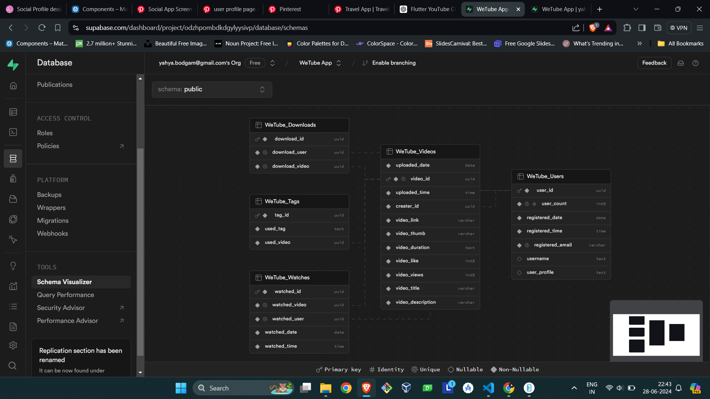
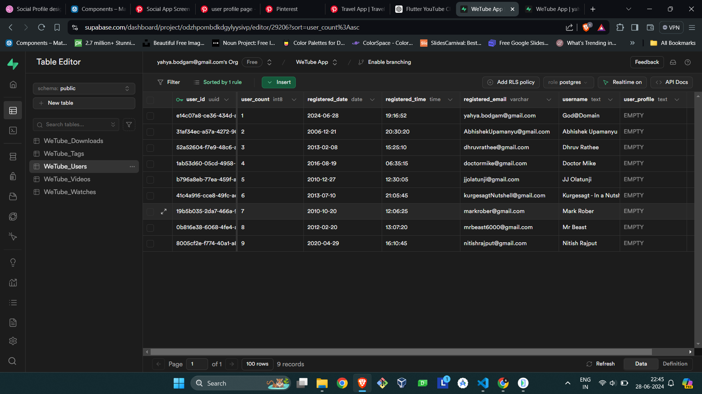
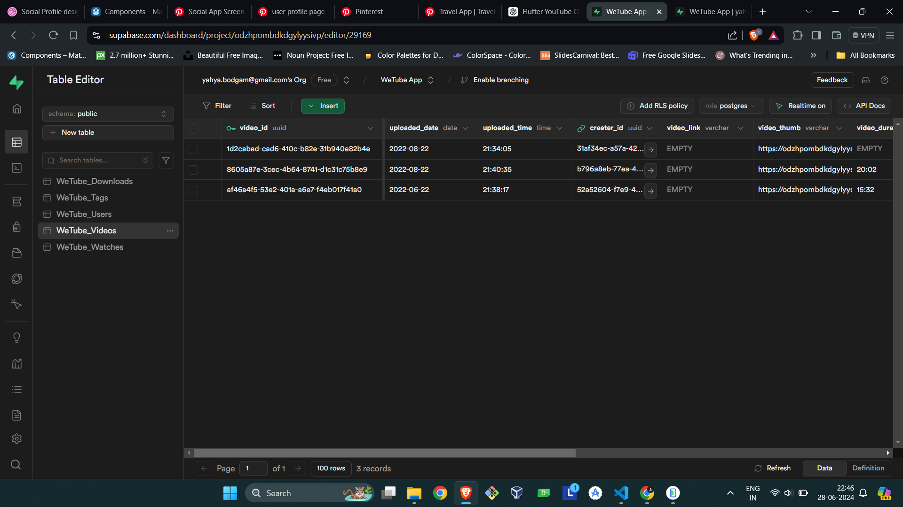
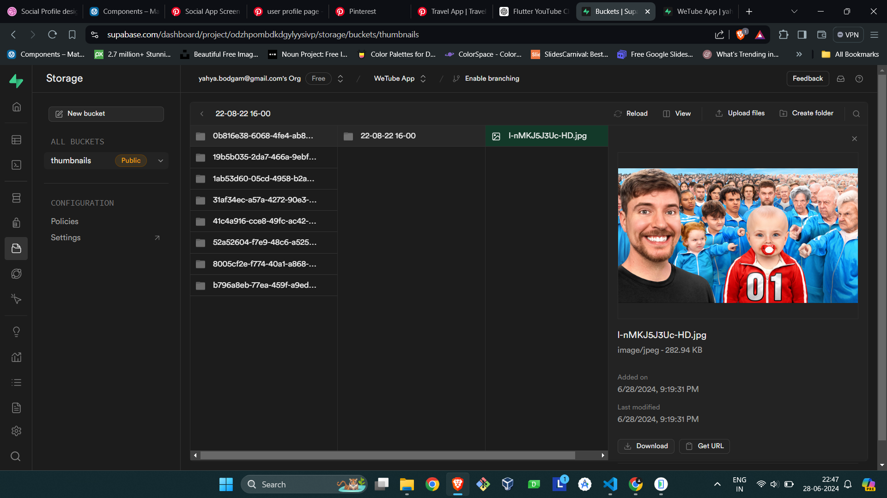
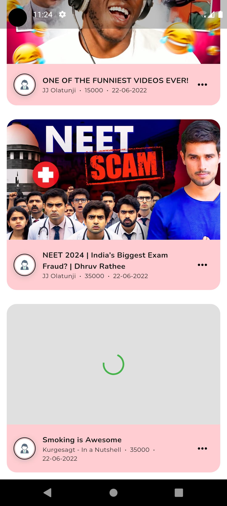

# YouTube Clone App Documentation

## Table of Contents
1. [Overview](#overview)
2. [Features](#features)
3. [Database Schema](#database-schema)
    - [Videos Table](#videos-table)
4. [Implementation](#implementation)
    - [Technologies Used](#technologies-used)
    - [Components](#components)
        - [Navbar](#code-snippet-navbar)
5. [Screenshots](#screenshots)
6. [Conclusion](#conclusion)

## Overview
This project is a YouTube clone application built using Flutter and Supabase. It aims to provide users with a familiar interface for browsing and watching videos, similar to YouTube. The app includes features such as a authentication, simless UI, a horizontal list of tags for personalized video tags, and a vertical list of video thumbnails fetched from a Supabase database.

### Challenges and Difficulties

During the development of WeTube, I faced challenges such as:

- Handling asynchronous operations and state management in Flutter.
- Implementing a clean and attractive UI design.
- Integrating postgres sql and processing supabase responses.

Despite these challenges, I overcame them through research, online tutorials, and leveraging the Flutter community for guidance.


## Features
- **Login:** Used for Authentication of user.
- **Navbar:** Implemented and styled for navigation across the application.
- **Video Cards:** Designed to display video thumbnails and metadata.
- **Video Playback:** Designed to comfort the user to simlessly go throught the video
- **Likes:** User can give his/her opinion if its good by giving a like to the video 

## Database Schema
### Videos Table
- **Fields:**
  - `id`: Unique identifier for each video.
  - `title`: Title of the video.
  - `description`: Description of the video content.
  - `thumbnail_url`: URL to the thumbnail image.
  - `category`: Category or genre of the video.
  - `upload_date`: Date when the video was uploaded.
  - `views`: Number of views for the video.
  - `duration`: Duration of the video in seconds.

## Implementation
### Technologies Used
- **Flutter:** For building the frontend UI components.
- **Supabase:** Used as the backend database for storing video details.

### Components
- **Navbar:** Fully functional for seamless navigation.
- **Video Cards:** Customized to display thumbnails and metadata.
- **Chips:** Implemented to categorize and filter videos.

### Code Snippet (Navbar)
```dart
// Example code snippet for Navbar implementation in Flutter

FutureBuilder<List<HomeThumbnail>>(
                future: _videosFuture,
                builder: (context, snapshot) {
                  if (snapshot.connectionState == ConnectionState.waiting) {
                    return const Center(child: CircularProgressIndicator());
                  } else if (snapshot.hasError) {
                    return Center(child: Text('Error: ${snapshot.error}'));
                  } else if (!snapshot.hasData || snapshot.data!.isEmpty) {
                    return const Center(child: Text('No videos found.'));
                  } else {
                    final videos = snapshot.data!;

                    return videos == []
                        ? const Center(child: Text('No videos found'))
                        : ListView.builder(
                            itemCount: videos.length,
                            itemBuilder: (context, index) {
                              return ThumbnailCard(
                                videoThumbnail: videos[index],
                              );
                            },
                          );
                  }
                },
              ),

```

## Screenshots












## Conclusion
This markdown file summarizes the key components and features of the YouTube clone application, providing insights into its structure and functionality.
